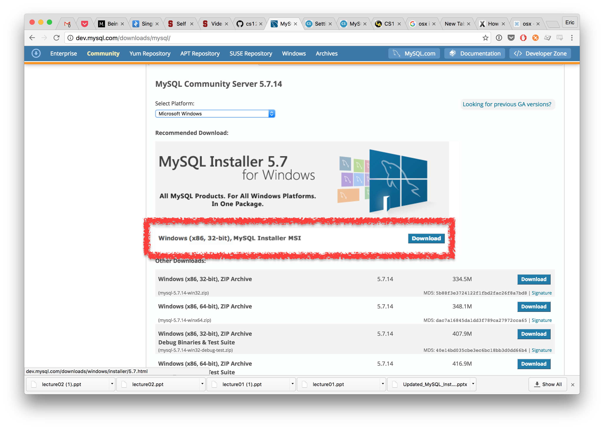
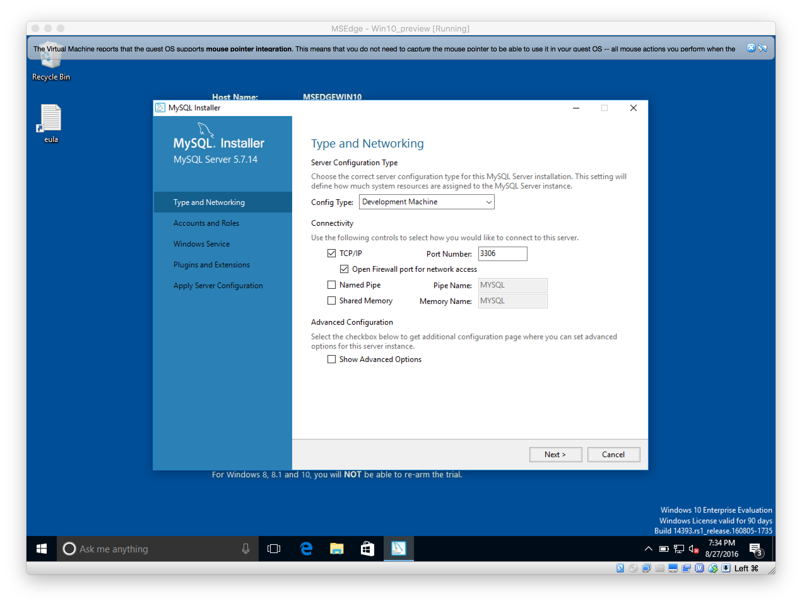
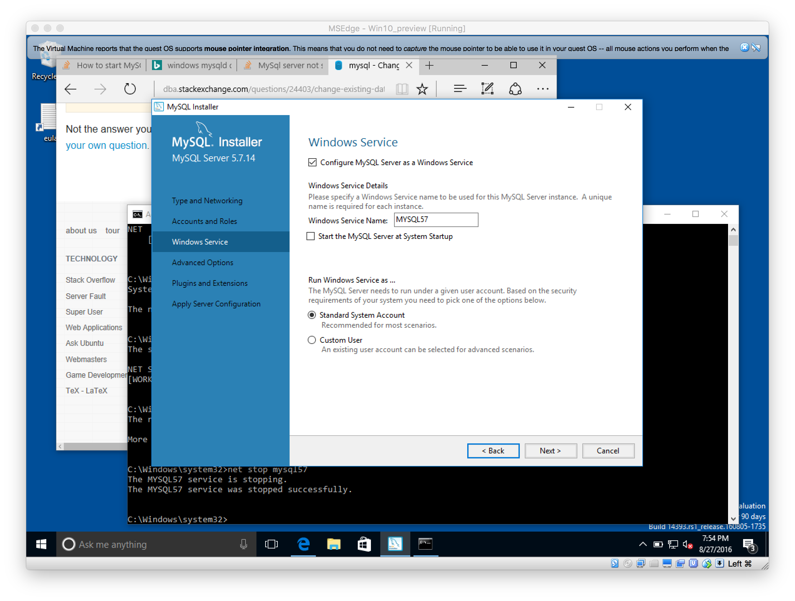

# Set up MySQL server and workbench

This note is for setting up both MySQL server and MySQL workbench for MacOS and
Windows.

Note that it's important for you to remember to start MySQL server before running MySQL workbench.

## Laboratory computer

If you are using laboratory computer (the computer you don't have admin access to),
you can consider running portable MySQL server here -- http://portableapps.com/apps/development/xampp

Once you installed the MySQL above, you can start the MySQL server from its interface.

## Windows

For windows, please go to the https://dev.mysql.com/downloads/mysql/ to download
MySQL community server.

> Note that it's probably easier for you to use installer like below  
> 

Set up as development machine.


While installing, please select not starting MySQL service from the start if you prefer not to start.


Upon installation, you can start your service by `net start mysql57` and stop by `net stop mysql57`.

> Mysql57 is coming from the earlier service set up screen

## MacOS

Install via [brew](http://brew.sh/)

```sh
brew install mysql
```

And then you can start the server by `mysql.server start`.

When you finish what you need to do with the server, run `mysql.server stop` to stop server

Once you installed the server, you can confirm by using MySQL workbench to connect to it.
If you are seeing issue like `Table 'performance_schema.session_variables' doesn't exist`,
please run `mysql_upgrade -u root -p --force`.

Reference: http://stackoverflow.com/questions/31967527/table-performance-schema-session-variables-doesnt-exist

## MySQL Workbench

Go to http://dev.mysql.com/downloads/workbench/ to download it and install it.
