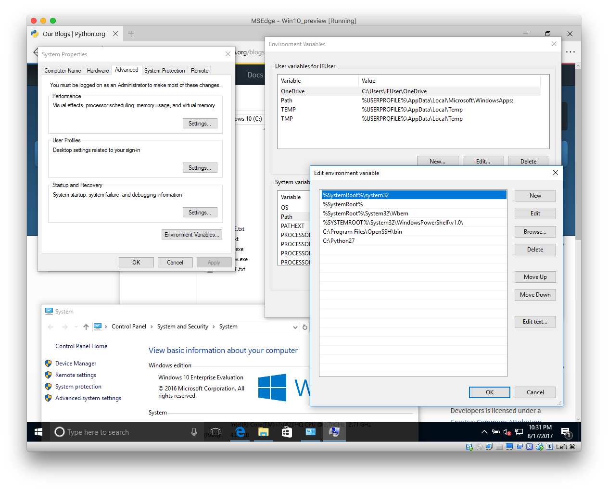

# Python environment setup

This note is to install Python!

To install Python, go to [Python official download page](https://www.python.org/downloads/)

## Windows User

Go https://www.python.org/downloads/windows/ and download installer

After install Python, remember to set up PATH variable.



## Mac User

```
brew install python
```

> If you don't have [Brew](https://brew.sh/) install yet. Go install it!

## Linux User

> Well, you are using Linux. You know what to do ...

Usually, Linux has Python 2 built-in already. In other word, you don't need to
specifically install Python 2.

## Check if installed

You should be able to type in `python --version` to see which version of Python
you have.

```
# rcliao @ Erics-MacBook-Pro in ~ [22:15:37]
$ python --version
Python 2.7.13
```

